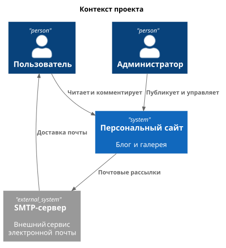
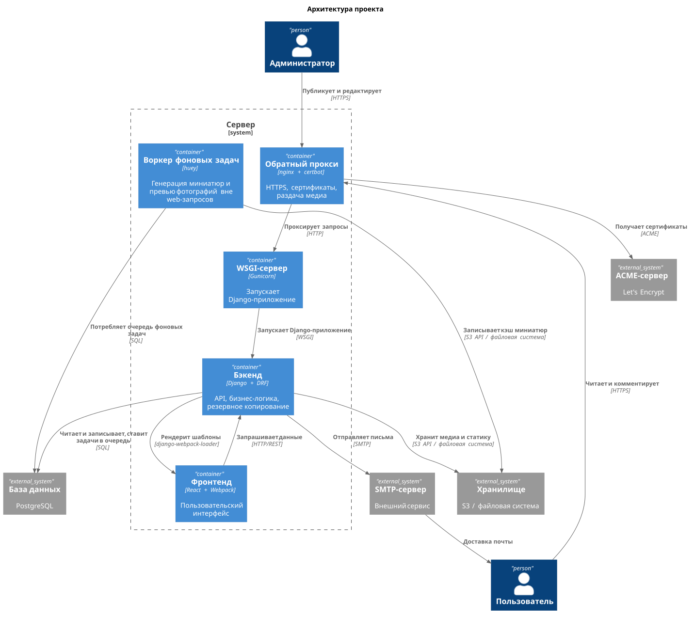
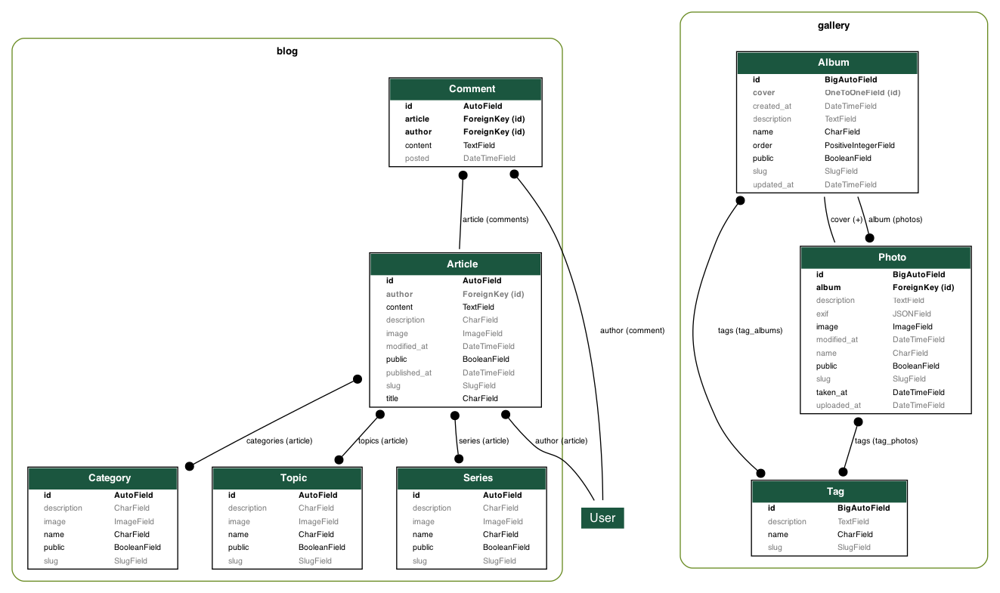

# Персональный сайт

Проект по созданию персонального сайта. Конфигурация, функции, классы и шаблоны максимально абстрактными - так, чтобы можно было использовать проект в качестве шаблона для другого сайта.

## Функциональность сайта

Для сайта реализован следующий функционал:

* Блог: статьи и комментарии.
* Галерея: альбомы и фотографии.
* Скрипты: ручной и автоматический запуск, просмотр логов.
* Пользователи: регистрация и авторизация.
* Администрирование: CRUD, настройка ролей.

## Технологический стек

Проект использует следующие технологии:

* [Django](https://www.djangoproject.com/) (бэкенд)
* [Django REST Framework](https://www.django-rest-framework.org/) (REST API)
* [React](https://react.dev/) 19 (фронтенд)
* [Webpack](https://webpack.js.org/) 5 (сборка фронтенда)
* [Bootstrap](https://getbootstrap.com/) 5 (стили)
* [PostgreSQL](https://www.postgresql.org/) 15 (база данных)
* [MinIO](https://min.io/) (объектное хранилище, S3-совместимое)

Проект адаптрован для развертывания на Linux. Для развертывания на Linux используются следующие технологии:

* [Gunicorn](https://gunicorn.org/) (HTTP-сервер)
* [Traefik](https://traefik.io/) (прокси-сервер, TLS-терминирование)
* [Docker](https://www.docker.com/) (контейнеризация)

## Структура проекта

Проект использует монорепозиторийную структуру с разделением на бэкенд и фронтенд:

    personal-website/           # корневая директория репозитория
    ├── .git/
    ├── .venv/
    ├── .gitignore
    ├── requirements.txt
    ├── pyproject.toml
    ├── package.json
    ├── tools/                  # вспомогательные скрипты для разработки
    ├── tests/                  # пакет интеграционных тестов
    ├── traefik/                # состояние ACME-клиента (сертификаты Let's Encrypt)
    ├── backend/                # Django бэкенд
    │   ├── manage.py
    │   ├── Dockerfile          # параметры сборки контейнера приложения
    │   ├── entrypoint.sh       # скрипт для запуска приложения в контейнере
    │   ├── scripts/            # скрипты для рантайма
    │   ├── config/             # шаблоны конфигурационных файлов для рантайма
    │   ├── personal_website/   # директория с настройками проекта
    │   │   ├── __init__.py
    │   │   ├── settings.py
    │   │   ├── urls.py
    │   │   ├── asgi.py
    │   │   ├── storages.py     # настройки файловых хранилищ (локальная файловая система, S3)
    │   │   └── wsgi.py
    │   ├── accounts/           # приложение Django (управление пользователями)
    │   ├── blog/               # приложение Django (блог)
    │   ├── gallery/            # приложение Django (галерея)
    │   ├── main/               # приложение Django (главная страница)
    │   ├── api/                # приложение Django (REST API)
    │   ├── staticfiles/        # статические файлы Django
    │   ├── templates/          # шаблоны Django
    │   └── tests/              # пакет тестов бэкенда
    └── frontend/               # React фронтенд
        ├── src/                # исходный код React компонентов
        │   ├── components/     # React компоненты
        │   ├── index.js        # точка входа
        │   └── ...
        ├── webpack.config.js   # конфигурация Webpack
        ├── jest.config.js      # конфигурация Jest
        ├── eslint.config.mjs   # конфигурация ESLint
        ├── .babelrc            # конфигурация Babel
        └── package.json       # зависимости фронтенда (симлинк на корневой)

## Административные команды

Для запуска веб-сервера Django используется команда:

    python backend/manage.py runserver

После внесения изменений в модели необходимо произвести миграцию таблиц базы данных. Django имеет встроенный инструмент управления миграциями. Для проведения миграций используются команды:

    python backend/manage.py makemigrations
    python backend/manage.py migrate

В данном проекте созданы пользовательские административные команды, которые используются для выполнения обособленных скриптов. Вызываются аналогичным образом:

    python backend/manage.py <имя команды>

## Режим разработки

Для локальной разработки необходимо запускать фронтенд и бэкенд отдельно в режиме наблюдения за изменениями файлов.

Сервисы postgres и minio в compose.yaml относятся к профилю dev и запускаются только при активном профиле: через переменную `COMPOSE_PROFILES=dev` в файле `.env` или через флаг `docker compose --profile dev`. Без активного профиля поднимаются только сервисы website и traefik — используйте этот режим, если база данных и объектное хранилище предоставляются вне Docker Compose.

### Запуск с использованием Taskfile (рекомендуется)

* Запустить сервер разработки с PostgreSQL: `task runserver`
* Запустить в режиме hot-reload: `task watch`
* Полный цикл тестирования: `task test`
* Статический анализ: `task check`

### Ручной запуск режима разработки

* Запустить базу данных PostgreSQL через Docker Compose: `docker compose up -d postgres`
* Применить миграции базы данных: `poetry run python backend/manage.py migrate`
* Собрать статические файлы: `poetry run python backend/manage.py collectstatic --noinput`
* Запустить сборку фронтенда в режиме наблюдения (в первом терминале): `npm run dev`
* Запустить сервер разработки Django (во втором терминале): `poetry run python backend/manage.py runserver`
* Открыть сайт в браузере: <http://localhost:8000> (админ-панель: <http://localhost:8000/admin/>)

Явное указание имени сервиса в команде активирует профиль автоматически, поэтому для запуска отдельных dev-сервисов флаг не требуется.

### Frontend разработка

* Сборка в режиме наблюдения: `npm run dev`
* Запуск Jest тестов: `npm test`
* Запуск тестов в режиме наблюдения: `npm run test:watch`
* Production сборка: `npm run build`
* Линтинг JavaScript: `npm run eslint`

### Остановка режима разработки

* Нажать `Ctrl+C` в обоих терминалах для остановки процессов
* Остановить контейнеры Docker: `docker compose down` (или `docker-compose down` для V1)

## Настройка файлового хранилища

Проект поддерживает два типа файловых хранилищ:

1. Локальная файловая система (по умолчанию)
2. S3-совместимое хранилище (например, Amazon S3 или MinIO)

Для выбора типа хранилища используется переменная окружения `STORAGE_TYPE`:

* `filesystem` - локальная файловая система (значение по умолчанию)
* `s3` - S3-совместимое хранилище

### Настройка S3-совместимого хранилища

Для использования S3-совместимого хранилища необходимо установить следующие переменные окружения:

    STORAGE_TYPE=s3
    AWS_ACCESS_KEY_ID=your-access-key-id
    AWS_SECRET_ACCESS_KEY=your-secret-access-key
    AWS_STORAGE_BUCKET_NAME=your-bucket-name
    AWS_S3_REGION_NAME=us-east-1
    AWS_S3_ENDPOINT_URL=http://localhost:9000  # для MinIO

В проекте уже настроен MinIO через Docker Compose для локальной разработки с S3. Сервис minio относится к профилю dev: `docker compose up -d minio` активирует профиль автоматически.

## Настройка базы данных

Проект поддерживает различные варианты развертывания PostgreSQL:

* Docker контейнер с PostgreSQL (локальная разработка)
* Управляемый PostgreSQL (Managed Service) от облачного провайдера
* Локальный PostgreSQL на сервере (через systemd)

### PostgreSQL в контейнере

При создании контейнера с кластером базы данных [PostgreSQL](https://www.postgresql.org/) на основе [официального образа postgres](https://hub.docker.com/_/postgres) база данных создается автоматически в соответствии со значениями переменных окружения `POSTGRES_USER`, `POSTGRES_PASSWORD` и `POSTGRES_DB`, указанными в файле [compose.yaml](./compose.yaml). Для подключения к базе данных необходимо использовать имя хоста `postgres`, если сервис, из которого производится подключение, также запускается при помощи Docker Compose, и имя хоста `localhost` в случаях, если сервис запускается на том же хосте, но не через Docker Compose.

### Ручное создание базы данных PostgreSQL

Переключиться на учетную запись postgres:

    sudo -i -u postgres

Войти в интерпретатор PostgreSQL:

    psql

Создать пользователя:

    CREATE USER user WITH PASSWORD 'password';

Создать базу данных:

    CREATE DATABASE name OWNER user ENCODING 'UTF8';

Выйти из интерпретатора PostgreSQL:

    \q

Переключиться на стандартного пользователя:

    \exit

### Переменные окружения для подключения

* `POSTGRES_HOST` — хост БД (localhost, FQDN кластера)
* `POSTGRES_PORT` — порт (5432 локальный, 6432 для managed)
* `POSTGRES_USER` — имя пользователя
* `POSTGRES_PASSWORD` — пароль
* `POSTGRES_DB` — имя базы данных
* `POSTGRES_SSL_MODE` — режим SSL (prefer, require, verify-full)
* `POSTGRES_SSL_ROOT_CERT_PATH` — путь к SSL сертификату CA

### SSL для Managed PostgreSQL

Для публичного доступа к managed-сервисам (например, Yandex Cloud Managed Service for PostgreSQL) требуется SSL-подключение с проверкой сертификата CA. Проект использует runtime-модель доставки сертификата: один и тот же Docker-образ проходит цепочку test → release без «запекания» сертификата на этапе сборки, а сам сертификат доставляется при запуске.

Сертификат помещается по каноническому пути `POSTGRES_SSL_ROOT_CERT_PATH` (по умолчанию `~/.postgresql/root.crt` — дефолтный путь поиска libpq, см. документацию PostgreSQL, раздел 32.19.1). При таком расположении libpq находит сертификат автоматически, и явно указывать `sslrootcert` не нужно.

Переменные окружения:

* `POSTGRES_SSL_MODE` — режим SSL (читает Django). Рекомендуется `verify-full` для managed-сервисов.
* `POSTGRES_SSL_ROOT_CERT_PATH` — канонический путь к файлу сертификата CA, который читает Django (как `sslrootcert`). Используется во всех сценариях: bare-metal, Docker-контейнер, Kubernetes pod. Дефолт `~/.postgresql/root.crt` (конвенция libpq). Если переменная не задана, `sslrootcert` опускается и libpq сам ищет сертификат в `~/.postgresql/root.crt`.
* `POSTGRES_SSL_CERT_HOST_PATH` — путь к сертификату на хосте, куда пишет `pgcert.sh` и откуда `compose.yaml` монтирует. Нужен только в Docker, когда пути хоста и контейнера различаются. Если не задан — `pgcert.sh` и compose откатываются на `POSTGRES_SSL_ROOT_CERT_PATH`.
* `POSTGRES_SSL_CERT_URL` — URL для скачивания сертификата (читает скрипт [scripts/pgcert.sh](./scripts/pgcert.sh)). Непустое значение — триггер загрузки; пустое — сертификат не скачивается (для провайдеров без статического URL сертификат помещается вручную).

`pgcert.sh` пишет сертификат по пути `POSTGRES_SSL_CERT_HOST_PATH`, а если та не задана — по `POSTGRES_SSL_ROOT_CERT_PATH`. Загрузка выполняется идемпотентно; вызывается из [scripts/server/setup.sh](./scripts/server/setup.sh) и [scripts/docker/setup.sh](./scripts/docker/setup.sh). Принудительное обновление (например, при ротации CA провайдером):

    bash scripts/pgcert.sh --force

Доставка сертификата в разных средах:

* Bare-metal: задаётся только `POSTGRES_SSL_ROOT_CERT_PATH`; `pgcert.sh` пишет туда же, Django/gunicorn читает через libpq (общая файловая система).
* Docker Compose, пути совпадают: достаточно `POSTGRES_SSL_ROOT_CERT_PATH` — compose монтирует сертификат в контейнер по тому же пути (см. [compose.yaml](./compose.yaml)).
* Docker Compose, пути различаются: `POSTGRES_SSL_CERT_HOST_PATH` (хост) + `POSTGRES_SSL_ROOT_CERT_PATH` (контейнер) — compose связывает их монтированием.
* Docker без Compose:

      docker run -v ~/.postgresql/root.crt:/root/.postgresql/root.crt:ro \
                 -e POSTGRES_SSL_MODE=verify-full \
                 ghcr.io/mikhpo/personal-website:latest

* Kubernetes: сертификат помещается в Secret и монтируется в pod по пути `POSTGRES_SSL_ROOT_CERT_PATH`.

### Миграция между провайдерами

При смене облачного провайдера достаточно обновить переменные окружения в `.env` файле и при необходимости обновить сертификат флагом `--force`. Процедуры дампа и восстановления БД стандартными утилитами `pg_dump`/`pg_restore` приведены в разделе «Резервное копирование и восстановление базы данных».

## Резервное копирование и восстановление базы данных

Основная защита данных — автоматические резервные копии, которые делает провайдер управляемого кластера PostgreSQL. Стандартные утилиты pg_dump и pg_restore нужны для разовых операций: копия перед изменениями, перенос между провайдерами, независимая от облака резервная копия.

Параметры подключения — те же, что использует приложение (см. раздел «Настройка базы данных»). Утилиты libpq принимают их флагами:

* `-h <хост>` — имя хоста или путь к каталогу unix-сокета;
* `-p <порт>` — порт сервера;
* `-U <пользователь>` — имя пользователя БД;
* `-d <база>` — имя базы данных.

Пароль можно передать двумя способами:

* переменная окружения `PGPASSWORD`;
* файл `~/.pgpass` (постоянная запись, пароль не нужно указывать в каждой команде).

Версия pg_dump и pg_restore должна быть не ниже версии кластера. Сравнить:

    pg_dump --version
    psql … -c "SELECT version();"

Если дефолтный клиент младше сервера — установить пакет нужной версии или вызвать совместимый бинарник явным путём.

### Создание резервной копии

Имя файла — по соглашению `<база>_<дата>.dump`, например `personal_website_2026-08-13.dump`:

    export PGPASSWORD='<пароль>'
    pg_dump -h <хост> -p <порт> -U <пользователь> -d <база> \
        -Fc --no-privileges --no-subscriptions --no-publications \
        -f personal_website_$(date +%F).dump

Формат `-Fc` (custom) компактный и допускает выборочное восстановление. Готовый файл размещается там, где хранятся резервные копии (локальное хранилище, объектное хранилище и т. п.) — способ зависит от инфраструктуры.

### Восстановление из резервной копии

Порядок зависит от того, существует ли уже целевая база.

Вариант 1 — база уже существует (типично для управляемых кластеров, где её создаёт провайдер). Восстановление в существующую базу:

    export PGPASSWORD='<пароль>'
    pg_restore -h <хост> -p <порт> -U <пользователь> -d <база> \
        -Fc --no-owner --no-privileges personal_website_2026-08-13.dump

Если база не пуста — добавить `--clean --if-exists`, чтобы пересоздать объекты.

Вариант 2 — базу нужно создать. На управляемом кластере без права CREATEDB база создаётся средствами провайдера (консоль/CLI), после чего применяется вариант 1. При наличии права CREATEDB (локальный или самостоятельный PostgreSQL) базу можно создать самой утилитой:

    export PGPASSWORD='<пароль>'
    pg_restore -h <хост> -p <порт> -U <пользователь> \
        -Fc --no-owner --no-privileges --create personal_website_2026-08-13.dump

Флаг `--create` создаёт базу с именем, записанным в дампе. Флаги `--no-owner` и `--no-privileges` переносят владение на подключённого пользователя и пропускают роли источника.

## Развертывание на сервере (Docker)

Основной способ развертывания — Docker Compose с сервисами website (образ приложения из реестра) и traefik (проксирование и терминирование TLS). База данных и объектное хранилище предоставляются внешними сервисами (managed PostgreSQL, S3); для локальной разработки предусмотрены сервисы postgres и minio профиля dev (см. раздел «Режим разработки»).

### Первичная настройка сервера

На новом сервере выполняется один раз:

    bash scripts/docker/setup.sh

Скрипт устанавливает системные пакеты (включая MinIO Client для резервного копирования), Docker, настраивает файрвол ufw (порты 22, 80, 443), скачивает SSL-сертификат PostgreSQL, создает каталоги для bind-mounts, добавляет задачу cron для резервного копирования и запускает контейнеры. Перед запуском необходимо заполнить файл `.env` (см. [.env.example](./.env.example)).

### Обновление приложения

Обновление выполняется скриптом, который используется CI/CD (deploy-workflow) и пригоден для ручного запуска:

    bash scripts/docker/deploy.sh

Скрипт обновляет файлы проекта из основной ветки репозитория, подготавливает каталоги и пересоздает контейнеры из свежих образов. Ручное обновление без участия CI выполняется также через `scripts/docker/update.sh` (включает предварительное резервное копирование файлового хранилища и очистку неиспользуемых образов).

### Переменные окружения

Полный список переменных окружения с описаниями зафиксирован в файле [.env.example](./.env.example). Отдельные переменные описаны в соответствующих разделах: `TRAEFIK_CERT_RESOLVER` и `ACME_EMAIL` — в разделе «Сертификаты Let's Encrypt (Traefik)», `STORAGE_TYPE` — в разделе «Настройка файлового хранилища», `COMPOSE_PROFILES` — в разделе «Режим разработки». Требование экранирования символа доллара в значениях `.env` описано в разделе «Развертывание» [руководства по разработке](./CONTRIBUTING.md).

Порт приложения наружу не публикуется: весь внешний трафик проходит через traefik (порты 80/443).

### Сертификаты Let's Encrypt (Traefik)

HTTPS-соединения обслуживает Traefik: сертификаты Let's Encrypt получаются и обновляются автоматически, отдельный порт для валидации не требуется. Адрес электронной почты для регистрации и уведомлений задаётся переменной окружения `ACME_EMAIL` в файле `.env`.

Состояние ACME-клиента хранится в файле `traefik/letsencrypt/acme.json` (каталог примонтирован в контейнер как bind-mount). Файл содержит приватный ключ аккаунта ACME, выпущенные сертификаты и метаданные расписания перевыпуска. При наличии валидного сертификата обращения к Let's Encrypt не выполняются; перевыпуск инициируется автоматически не позднее чем за 30 дней до истечения срока действия.

Поскольку каталог `traefik/letsencrypt` размещён на хосте, команда `docker compose down -v` не затрагивает сертификаты. Вместе с тем указанная команда удаляет именованные тома `postgres-data` и `minio-data`; применение флага `-v` должно быть осознанным решением.

Перенос между серверами с Docker: скопировать `acme.json` на новый сервер до первого запуска Traefik (например, `scp traefik/letsencrypt/acme.json <пользователь>@<хост>:<путь>/traefik/letsencrypt/`). Аккаунт ACME и действующий сертификат сохраняются, обращения к Let's Encrypt не требуются. Повторный запуск с пустым файлом до переноса приводит к регистрации нового аккаунта и перевыпуску сертификата. При миграции с сервера без Traefik (или если файл не переносится) сертификат выпускается заново; чтобы избежать периода без сертификата, полезно до переключения DNS выполнить с нового сервера запрос `curl --resolve <домен>:443:<IP-нового-сервера> https://<домен>/` — сертификат будет получен заранее.

Утрата файла `acme.json` не приводит к простою: при первом HTTPS-запросе Traefik регистрирует аккаунт и выпускает сертификат повторно (в пределах нескольких секунд). Ограничение — квота Let's Encrypt на повторные выпуски набора доменов (5 в неделю), поэтому многократная утрата файла недопустима. Файл содержит приватные ключи; рекомендуется включить его в резервное копирование с размещением в защищённом хранилище.

## Приложения проекта

Проект содержит следующие приложения:

* `accounts` - управление учетными записями
* `main` - главная страница сайта
* `blog` - блог
* `gallery` - галерея

Модель данных проекта:

### Контроль учетных записей

Приложение управляет процессом создания учетных записей. Базовая модель аутентификации пользователей Django слишком слабая для серьезного использования. Данное приложение не создает альтернативную модель пользователя, но накладывает дополнительные ограничения, расширяя функционал формы регистрации:

1. Обязательно указание адреса электронной почты.
2. Адрес электронной почты должен быть уникальным.
3. Имя и фамилия не должны совпадать.

### Главная

Управление главной страницей сайта. Главная страница служит витриной для перехода к другим разделам сайта.

### Блог

Одно из ключевых приложений сайта - управление блогом и комментариями к записям в нем.

В рамках блога используются следующие модели:

1. Статья - как единичная запись в блоге, ключевая модель приложения.
2. Комментарий - пользователи могут оставлять к статьям комментарии.
3. Серия - статьи могут объединяться в серии.
4. Тема - серии могут объединяться по темам.
5. Категория - темы могут объединяться по категориям.

Статьи можно создавать и редактировать через административный интерфейс. Тело статьи редактируется при помощи WYSIWYG-виджета TinyMCE. Статью можно создать, но не опубликовать - для этого есть специальный флаг. При помощи него же опубликованную статью можно снять с публикации.

### Галерея

Управление фотографиями и альбомами.

Модели галереи:

1. Фотография
1. Альбом
1. Тэг

Управлять альбомами, фотографиями и тэгами можно через административный интерфейс. Также через пользовательский интерфейс галереи доступна пакетная загрузка фотографий в альбом.

Фотографии и альбомы могут быть публичными и непубличными. Публичность объекта определяет его видимость для пользователя и поисковых машин.

Для фотографий реализован автоматический парсинг метаданных в формате EXIF.

## REST API

Проект предоставляет REST API для взаимодействия с фронтендом и сторонними приложениями.

### Технологии API

* [Django REST Framework](https://www.django-rest-framework.org/) — фреймворк для создания REST API
* [djangorestframework-simplejwt](https://django-rest-framework-simplejwt.readthedocs.io/) — JWT аутентификация
* [drf-spectacular](https://drf-spectacular.readthedocs.io/) — генерация OpenAPI 3.0 схемы
* [django-filter](https://django-filter.readthedocs.io/) — фильтрация наборов данных

Документация работает в offline режиме за счет drf-spectacular-sidecar.

## Frontend

Фронтенд построен на React с использованием Webpack для сборки и интеграции с Django.

### Технологии фронтенда

* [React](https://react.dev/) 19 — UI библиотека
* [Bootstrap](https://getbootstrap.com/) 5 — стили
* [Webpack](https://webpack.js.org/) 5 — сборка
* [Babel](https://babeljs.io/) — транспиляция JSX и ES6+
* [Jest](https://jestjs.io/) — тестирование компонентов
* [django-webpack-loader](https://github.com/django-webpack/django-webpack-loader) — интеграция бандлов с Django

### Структура фронтенда

    frontend/
    ├── src/
    │   ├── components/     # React компоненты
    │   │   ├── Alert/      # Алерты и уведомления
    │   │   ├── Blog/       # Компоненты блога
    │   │   ├── Gallery/    # Компоненты галереи
    │   │   ├── Main/       # Компоненты главной страницы
    │   │   ├── Navbar/     # Навигация
    │   │   ├── Card/       # Базовый компонент карточки
    │   │   ├── Pagination/ # Пагинация
    │   │   └── Spinner/    # Индикатор загрузки
    │   ├── hooks/          # Кастомные React хуки
    │   ├── services/       # API сервисы
    │   ├── utils/          # Утилиты
    │   └── index.js        # Точка входа
    ├── dist/               # Production бандл
    └── webpack.config.js   # Конфигурация Webpack

### Команды фронтенда

| Команда              | Описание                   |
| -------------------- | -------------------------- |
| `npm run dev`        | Сборка в режиме наблюдения |
| `npm run build`      | Production сборка          |
| `npm test`           | Запуск Jest тестов         |
| `npm run test:watch` | Тесты в режиме наблюдения  |
| `npm run eslint`     | Проверка кода ESLint       |

### Интеграция с Django

React компоненты рендерятся в Django шаблонах через `django-webpack-loader`:

    
    
    

## CI/CD

Проект использует две системы автоматизации: GitHub Actions и SourceCraft CI. Развертывание на сервере выполняется deploy-workflow SourceCraft (целевой каталог /srv/personal-website); GitHub-зеркало используется для проверки кода и сборки образов.

### GitHub Actions Workflows

Подробности конфигурации см. в файлах `.github/workflows/*.yml`.

### Требуемые GitHub Secrets

| Секрет                | Описание                         |
| --------------------- | -------------------------------- |
| `SECRET_KEY`          | Секретный ключ Django            |
| `EMAIL_HOST_USER`     | Email для отправки уведомлений   |
| `EMAIL_HOST_PASSWORD` | Пароль email сервиса             |
| `DOMAIN_NAME`         | Доменное имя сайта               |
| `DOCKER_USERNAME`     | Имя пользователя Docker Hub      |
| `DOCKER_PASSWORD`     | Токен доступа Docker Hub         |
| `GHCR_DELETE_TOKEN`   | Токен для удаления тегов из GHCR |
| `SERVER_HOST`         | IP-адрес или домен VPS сервера   |
| `SERVER_USER`         | Имя пользователя на VPS          |
| `DEPLOY_SSH_KEY`      | SSH-ключ для деплоя              |

### 1. `test.yml` — Тестирование кода и контейнера

Workflow выполняет проверку качества кода, запуск тестов и сборку Docker-образа.

**Задачи (jobs):**

| Задача                    | Описание                                                      |
| ------------------------- | ------------------------------------------------------------- |
| `cache-poetry`            | Кэширование Python зависимостей Poetry                        |
| `cache-npm`               | Кэширование JavaScript зависимостей npm                       |
| `ruff_check`              | Проверка кода с помощью Ruff                                  |
| `mypy_check`              | Статический анализ типов Mypy                                 |
| `eslint_check`            | Статический анализ JavaScript кода ESLint                     |
| `markdownlint_check`      | Проверка Markdown файлов                                      |
| `jest_check`              | Тестирование React компонентов с Jest                         |
| `test_python_with_pytest` | Запуск тестов Python с помощью Pytest                         |
| `build_docker_image`      | Сборка Docker-образа и публикация в GHCR с тегом `test`       |
| `test_docker_container`   | Запуск тестов внутри контейнера, перетегирование как `tested` |

**Условия запуска:** при открытии, переоткрытии Pull Request или добавлении новых коммитов.

### 2. `release.yml` — Публикация образа в реестры

Перетегирует протестированный Docker-образ (`tested`) как `latest` и публикует в GHCR и Docker Hub.

**Задачи (jobs):**

| Задача                 | Описание                                                     |
| ---------------------- | ------------------------------------------------------------ |
| `retag_and_push_image` | Логин в реестры, перетегирование образа, публикация, очистка |

**Условия запуска:** после слияния Pull Request в `main` или вручную.

### 3. `deploy.yml` — Деплой на VPS сервер

Подключается к VPS серверу по SSH и выполняет скрипт обновления.

**Задачи (jobs):**

| Задача   | Описание                               |
| -------- | -------------------------------------- |
| `deploy` | Деплой приложения на VPS сервер по SSH |

**Условия запуска:** после успешного завершения workflow "Release image".

## SourceCraft CI/CD

Проект также использует SourceCraft CI/CD для автоматизации процессов тестирования, сборки и деплоя. Конфигурация — в файле [.sourcecraft/ci.yaml](./.sourcecraft/ci.yaml).

### Workflows

1. **lint-workflow** — статический анализ и линтинг, запускается при pull request
2. **test-workflow** — тестирование, запускается при pull request
3. **build-workflow** — сборка и тестирование образа приложения, запускается при pull request
4. **release-workflow** — релиз Docker-образа, запускается при пуше в основную ветку
5. **deploy-workflow** — деплой приложения на VPS, запускается вручную

### Требуемые секреты SourceCraft

| Секрет                    | Описание                                |
| ------------------------- | --------------------------------------- |
| `SECRET_KEY`              | Секретный ключ Django                   |
| `DOCKER_USERNAME`         | Имя пользователя Docker Hub             |
| `DOCKER_PASSWORD`         | Пароль доступа Docker Hub               |
| `YC_OAUTH_TOKEN`          | OAuth-токен Yandex Cloud                |
| `YC_CONTAINER_REGISTRY_ID`| ID реестра Yandex Container Registry    |
| `SERVER_HOST`             | IP-адрес или домен сервера              |
| `SERVER_USER`             | Имя пользователя на сервере             |
| `DEPLOY_SSH_KEY`          | SSH-ключ для деплоя                     |

### 1. `lint-workflow` — Статический анализ и линтинг

Workflow выполняет проверку качества кода с помощью Ruff и Mypy для Python кода, а также ESLint и markdownlint для JavaScript и Markdown файлов.

**Задачи (tasks):**

| Задача         | Описание                                                 |
| -------------- | -------------------------------------------------------- |
| `python-check` | Проверка Python кода с помощью Ruff и Mypy               |
| `node-check`   | Проверка JavaScript кода с помощью ESLint и markdownlint |

**Условия запуска:** при создании pull request в ветку `main` или `master`.

### 2. `test-workflow` — Тестирование

Workflow выполняет тестирование Python и JavaScript кода в изолированном окружении с предварительной сборкой React фронтенда.

**Задачи (tasks):**

| Задача        | Описание                                                               |
| ------------- | ---------------------------------------------------------------------- |
| `python-test` | Тестирование Python кода с помощью Pytest (со сборкой React фронтенда) |
| `node-test`   | Тестирование JavaScript кода                                           |

**Условия запуска:** при создании pull request в ветку `main` или `master`.

### 3. `build-workflow` — Сборка и тестирование образа приложения

Workflow выполняет сборку Docker-образа приложения, тестирование внутри контейнера и публикацию протестированного образа в реестры.

**Переменные окружения:**

* `SECRET_KEY` - секретный ключ Django приложения
* `DOCKER_USERNAME` и `DOCKER_PASSWORD` - учетные данные для Docker Hub
* `YC_OAUTH_TOKEN` и `YC_CONTAINER_REGISTRY_ID` - учетные данные для Yandex Cloud

**Задачи (tasks):**

| Задача                   | Описание                                                              |
| ------------------------ | --------------------------------------------------------------------- |
| `build-test-docker`      | Сборка Docker-образа и публикация в Docker Hub и Yandex Cloud         |
| `run-tests-in-container` | Запуск тестов внутри контейнера и публикация протестированного образа |

**Условия запуска:** при создании pull request в ветку `main` или `master`.

### 4. `release-workflow` — Релиз Docker-образа

Workflow перетегирует протестированный Docker-образ как `latest` и публикует его в Docker Hub и Yandex Cloud Container Registry.

**Задачи (tasks):**

| Задача           | Описание                                                               |
| ---------------- | ---------------------------------------------------------------------- |
| `release-docker` | Перетегирование образа как `latest` и публикация в реестры контейнеров |

**Условия запуска:** при пуше в основную ветку (`main` или `master`).

### 5. `deploy-workflow` — Деплой приложения на VPS сервер

Workflow для автоматического деплоя приложения на VPS сервер.

**Задачи (tasks):**

| Задача               | Описание                               |
| -------------------- | -------------------------------------- |
| `deploy-application` | Деплой приложения на VPS сервер по SSH |

Деплой выполняется скриптом [scripts/docker/deploy.sh](./scripts/docker/deploy.sh): обновление файлов проекта, пересоздание контейнеров из свежих образов.

**Условия запуска:** вручную.

### Альтернативные методы развертывания

Помимо основного Docker-развертывания сохраняется bare-metal способ запуска сервисов непосредственно в системе хоста (systemd-юниты Gunicorn, системный nginx, системный PostgreSQL). Скрипты для этого способа расположены в [scripts/server/](./scripts/server/) (setup.sh — первичная настройка, deploy.sh — деплой обновлений, restart.sh — перезапуск). Способ сохраняется для совместимости; для новых серверов рекомендуется Docker-развертывание.

## Дополнительная информация

* [Руководство по разработке](./docs/CONTRIBUTING.md)
* [История изменений](./docs/CHANGELOG.md)
