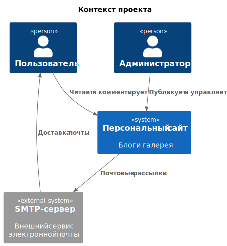
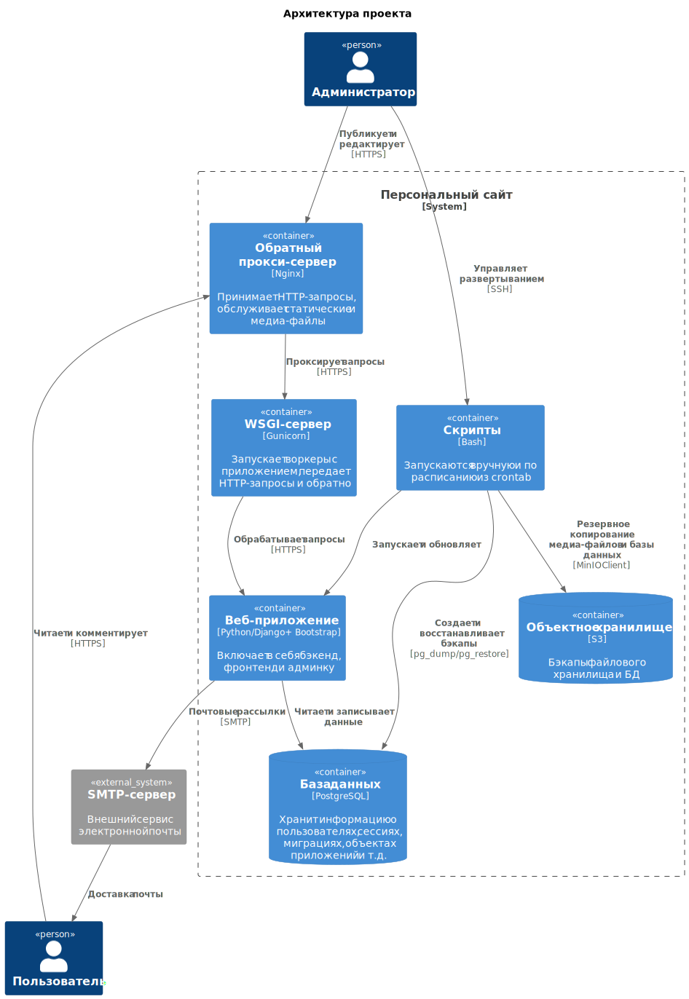
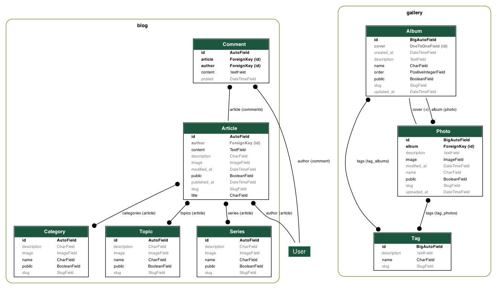

# Персональный сайт

Проект по созданию персонального сайта. Конфигурация, функции, классы и шаблоны максимально абстрактными - так, чтобы можно было использовать проект в качестве шаблона для другого сайта.

## Функциональность сайта

Для сайта реализован следующий функционал:

* Блог: статьи и комментарии.
* Галерея: альбомы и фотографии.
* Скрипты: ручной и автоматический запуск, просмотр логов.
* Пользователи: регистрация и авторизация.
* Администрирование: CRUD, настройка ролей.

## Технологический стек

Проект использует следующие технологии:

* [Django](https://www.djangoproject.com/) (бэкенд)
* [Bootstrap](https://getbootstrap.com/) (фронтенд)
* [PostgreSQL](https://www.postgresql.org/) (база данных)

Проект адаптрован для развертывания на Linux. Для развертывания на Linux используются следующие технологии:

* [Gunicorn](https://gunicorn.org/) (HTTP-сервер)
* [Nginx](https://nginx.org/) (прокси-сервер)
* [Docker](https://www.docker.com/) (контейнеризация)

## Структура проекта

Проект использует стандартную структуру каталогов, сформированную командой `django-admin startproject personal_website`:

    personal-website/           # корневая директория репозитория
    ├── .git/
    ├── .venv/
    ├── .gitignore
    ├── requirements.txt
    ├── pyproject.toml
    ├── package.json
    ├── tools/                  # вспомогательные скрипты для разработки
    ├── tests/                  # пакет интеграционных тестов
    ├── nginx/                  # файлы для сборки Nginx в контейнере
    └── personal_website/       # базовая директория проекта Django
        ├── manage.py
        ├── Dockerfile          # параметры сборки контейнера приложения
        ├── entrypoint.sh       # скрипт для запуска приложения в контейнере
        ├── scripts/            # скрипты для рантайма
        ├── config/             # шаблоны конфигурационных файлов для рантайма
        ├── personal_website/   # директория с настройками проекта
        │   ├── __init__.py
        │   ├── settings.py
        │   ├── urls.py
        │   ├── asgi.py
        │   └── wsgi.py
        ├── app1/               # приложение Django
        │   └── tests/          # пакет тестов приложения Django
        └── app2/               # приложение Django
            └── tests/          # пакет тестов приложения Django

## Административные команды

Для запуска веб-сервера Django используется команда:

    python personal_website/manage.py runserver

После внесения изменений в модели необходимо произвести миграцию таблиц базы данных. Django имеет встроенный инструмент управления миграциями. Для проведения миграций используются команды:

    python personal_website/manage.py makemigrations
    python personal_website/manage.py migrate

В данном проекте созданы пользовательские административные команды, которые используются для выполнения обособленных скриптов. Вызываются аналогичным образом:

    python personal_website/manage.py <имя команды>

## Приложения проекта

Проект содержит следующие приложения:

* `accounts` - управление учетными записями
* `main` - главная страница сайта
* `blog` - блог
* `gallery` - галерея

Модель данных проекта:

### Контроль учетных записей

Приложение управляет процессом создания учетных записей. Базовая модель аутентификации пользователей Django слишком слабая для серьезного использования. Данное приложение не создает альтернативную модель пользователя, но накладывает дополнительные ограничения, расширяя функционал формы регистрации:

1. Обязательно указание адреса электронной почты.
2. Адрес электронной почты должен быть уникальным.
3. Имя и фамилия не должны совпадать.

### Главная

Управление главной страницей сайта. Главная страница служит витриной для перехода к другим разделам сайта.

### Блог

Одно из ключевых приложений сайта - управление блогом и комментариями к записям в нем.

В рамках блога используются следующие модели:

1. Статья - как единичная запись в блоге, ключевая модель приложения.
2. Комментарий - пользователи могут оставлять к статьям комментарии.
3. Серия - статьи могут объединяться в серии.
4. Тема - серии могут объединяться по темам.
5. Категория - темы могут объединяться по категориям.

Статьи можно создавать и редактировать через административный интерфейс. Тело статьи редактируется при помощи WYSIWYG-виджета TinyMCE. Статью можно создать, но не опубликовать - для этого есть специальный флаг. При помощи него же опубликованную статью можно снять с публикации.

### Галерея

Управление фотографиями и альбомами.

Модели галереи:

1. Фотография
1. Альбом
1. Тэг

Управлять альбомами, фотографиями и тэгами можно через административный интерфейс. Также через пользовательский интерфейс галереи доступна пакетная загрузка фотографий в альбом.

Фотографии и альбомы могут быть публичными и непубличными. Публичность объекта определяет его видимость для пользователя и поисковых машин.

Для фотографий реализован автоматический парсинг метаданных в формате EXIF.

## Описание GitHub Actions

GitHub Actions обеспечивают:

* Автоматизированное тестирование и проверку качества кода при каждом Pull Request.
* Сборку и тестирование Docker-образа.
* Публикацию стабильного образа в GHCR и Docker Hub после успешного слияния в `main` или вручную.

### 1. `test.yml` — Тестирование кода и контейнера

Этот workflow выполняет проверку качества кода, запуск тестов и сборку Docker-образа. Если все проверки успешны, образ помечается как протестированный и публикуется в GitHub Container Registry (GHCR).

Workflow использует кэширование зависимостей для ускорения выполнения. Задачи `cache-poetry` и `cache-npm` создают кэш Python и JavaScript зависимостей соответственно. Кэш сохраняется с ключом, основанным на хэше lock-файлов (`poetry.lock` и `package-lock.json`).

Несмотря на использование кэширования, шаги `poetry install` и `npm install` остаются в зависимых задачах, потому что:

1. Кэш может отсутствовать при первом запуске или после изменений в зависимостях
2. При наличии кэша установка выполняется быстро, проверяя наличие зависимостей (1-2 секунды)
3. Это обеспечивает надежную работу workflow независимо от состояния кэша

Workflow состоит из следующих задач (jobs):

| Задача                    | Описание                                                                   | Зависимости                 |
|---------------------------|----------------------------------------------------------------------------|-----------------------------|
| `cache-poetry`            | Кэширование Python зависимостей Poetry                                     | —                           |
| `cache-npm`               | Кэширование JavaScript зависимостей npm                                    | —                           |
| `ruff_check`              | Проверка кода с помощью Ruff (линтер и форматтер)                          | `cache-poetry`              |
| `mypy_check`              | Статический анализ типов с помощью Mypy                                    | `cache-poetry`              |
| `eslint_check`            | Статический анализ JavaScript кода с помощью ESLint                        | `cache-npm`                 |
| `markdownlint_check`      | Проверка Markdown файлов с помощью markdownlint                            | `cache-npm`                 |
| `test_python_with_pytest` | Запуск тестов Python с помощью Pytest                                      | `cache-poetry`, `cache-npm` |
| `build_docker_image`      | Сборка Docker-образа и публикация в GHCR с тегом `test`                    | `test_python_with_pytest`   |
| `test_docker_container`   | Запуск тестов внутри контейнера, перетегирование и публикация как `tested` | `build_docker_image`        |

Условия запуска:

* Выполняется при открытии, закрытии, переоткрытии Pull Request, а также при добавлении новых коммитов в PR.

### 2. `release.yml` — Публикация образа в несколько реестров

* Перетегирует протестированный Docker-образ (`tested`) как `latest`.
* Публикует образ в:
  * GitHub Container Registry (GHCR)
  * Docker Hub
* Удаляет старый тег `tested` из GHCR.

Workflow состоит из одной задачи:

| Задача                 | Описание                                                                             |
| ---------------------- | ------------------------------------------------------------------------------------ |
| `retag_and_push_image` | Логин в GHCR и Docker Hub, перетегирование образа, публикация, удаление старого тега |

Условия запуска:

* Выполняется после закрытия Pull Request, если он был слит в ветку `main`.
* Может быть запущен вручную через `workflow_dispatch`.

### 3. `deploy.yml` — Деплой приложения на VPS сервер

Workflow для автоматического деплоя приложения на VPS сервер после успешного релиза.

Функциональность:

* Подключается к VPS серверу по SSH
* Выполняет скрипт обновления приложения на сервере

Workflow состоит из одной задачи:

| Задача    | Описание                                  |
| --------- | ----------------------------------------- |
| `deploy`  | Деплой приложения на VPS сервер по SSH    |

Условия запуска:

* Выполняется после успешного завершения workflow "Release image"

## Дополнительная информация

* [Руководство по разработке](../docs/CONTRIBUTING.md)
* [История изменений](../docs/CHANGELOG.md)
